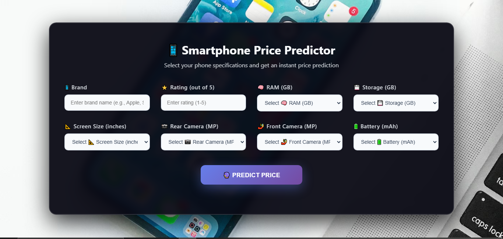
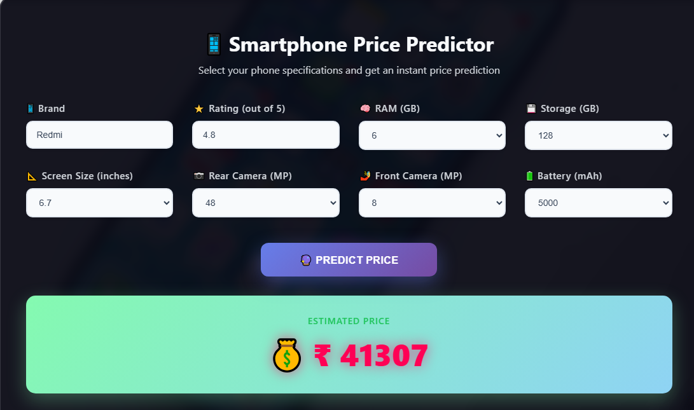

# Smartphone Price Prediction

[](https://www.python.org/)
[](https://flask.palletsprojects.com/)
[](https://react.dev/)
[](https://vitejs.dev/)
[](https://scikit-learn.org/)


Predict smartphone prices from key device specifications using an end-to-end ML workflow:
- model training in Jupyter Notebook
- Flask backend inference API
- React frontend prediction UI

## Live Demo

- Frontend: `Add your deployed frontend URL here`
- Backend API: `Add your deployed backend URL here`

## Table of Contents

- [Overview](#overview)
- [Screenshots](#screenshots)
- [Tech Stack](#tech-stack)
- [Project Structure](#project-structure)
- [Getting Started](#getting-started)
- [API Reference](#api-reference)
- [Contributing](#contributing)


## Overview

This project trains a regression model to estimate smartphone prices from hardware and brand attributes.  
The trained scikit-learn pipeline is exported as `mobile_price_pipeline.pkl` and loaded by a Flask API endpoint (`/predict`).  
A React UI sends user inputs to the API and displays the predicted price.

### Input Features

The model/API expects these fields:

- `Brand` (string)
- `Ratings` (number)
- `RAM` (number)
- `ROM` (number)
- `Mobile_Size` (number)
- `Primary_Cam` (number)
- `Selfi_Cam` (number)
- `Battery_Power` (number)

## Screenshots

Add screenshots in a folder like `assets/` and update paths below.

### App UI



### Prediction Result



## Tech Stack

- **Machine Learning:** `scikit-learn`, `pandas`, `numpy`, `joblib`
- **EDA / Visualization:** `jupyter`, `matplotlib`, `seaborn`
- **Backend:** `flask`, `flask-cors`
- **Frontend:** `react`, `vite`

## Project Structure

```text
Smartphone_Price_Prediction/
├── backend/
│   └── app.py
├── data/
│   └── mobile_price_prediction.csv
├── frontend/
│   ├── src/
│   │   ├── components/
│   │   │   └── Predictor.jsx
│   │   └── App.jsx
│   └── package.json
├── Smartphone_Price_Predictor.ipynb
├── requirements.txt
└── README.md
```

## Getting Started

### Prerequisites

- Python `3.9+`
- Node.js `18+` and npm
- Git

### 1) Clone repository

```bash
git clone <your-repo-url>
cd Smartphone_Price_Prediction
```

### 2) Setup Python environment

```bash
python -m venv .venv
```

Windows (PowerShell):
```bash
.venv\Scripts\Activate.ps1
```

Windows (Git Bash):
```bash
source .venv/Scripts/activate
```

Install dependencies:
```bash
pip install -r requirements.txt
```

### 3) Train and export model

Run all cells in `Smartphone_Price_Predictor.ipynb` to generate:
- `mobile_price_pipeline.pkl`

The backend loads this file from the project root.

### 4) Start backend API

```bash
python backend/app.py
```

Backend URL:
- `http://127.0.0.1:5000`

### 5) Start frontend

Open a new terminal:

```bash
cd frontend
npm install
npm run dev
```

Frontend URL (default):
- `http://localhost:5173`

## API Reference

### POST `/predict`

Predicts price based on smartphone features.

Request:

```json
{
  "Brand": "Samsung",
  "Ratings": 4.5,
  "RAM": 8,
  "ROM": 128,
  "Mobile_Size": 6.5,
  "Primary_Cam": 64,
  "Selfi_Cam": 16,
  "Battery_Power": 5000
}
```

Response:

```json
{
  "prediction": 28999
}
```

## Troubleshooting

- **`mobile_price_pipeline.pkl` not found:** retrain notebook and ensure file is in project root.
- **CORS or fetch errors:** start backend first, then frontend.
- **Unexpected predictions:** verify input values and data types used by frontend.


## Contributing

Contributions are welcome.

1. Fork the repository
2. Create a feature branch: `git checkout -b feature/your-feature-name`
3. Commit changes: `git commit -m "Add your message"`
4. Push branch: `git push origin feature/your-feature-name`
5. Open a Pull Request


